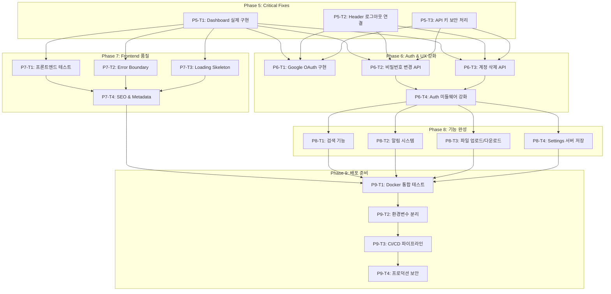

# TASKS.md - AI Agent Team Platform (v2: 코드 분석 기반 재생성)

> 코드 분석 기반 개선 태스크 구조
> 기존 45개 태스크 완료 후, 실제 코드 동작 분석으로 도출된 개선/누락 항목

---

## 의존성 그래프

---

# Phase 5: Critical Fixes (핵심 수정)

## [x] P5-T1: Dashboard 실제 UI 구현
- **담당**: frontend-specialist
- **현황**: `/dashboard` 페이지가 `/teams/new`로 무조건 리다이렉트 중 (실제 대시보드 UI 없음)
- **파일**: `frontend/src/app/(main)/dashboard/page.tsx` (현재 5줄: redirect만 존재)
- **스펙**:
  - 기존 TASKS.md P2-S1-T1 명세대로 구현:
    - StatsSummary: 오늘의 요약 카드 (진행중/완료/전체 팀) → `GET /api/v1/dashboard/stats`
    - TeamOrgChart: React Flow 기반 팀 조직도 → `GET /api/v1/teams`
    - CreateTeamButton: 새 팀 만들기 버튼
  - 팀이 없을 때만 `/teams/new`로 안내 (빈 상태 처리)
  - 팀이 있으면 통계 + 조직도 표시
- **API 의존**: `GET /api/v1/dashboard/stats`, `GET /api/v1/teams` (이미 구현됨)
- **완료 조건**:
  - [ ] 로그인 후 `/dashboard` 접속 시 통계 카드 3개 표시
  - [ ] React Flow 조직도에 팀 노드 표시
  - [ ] 팀 노드 클릭 시 `/teams/:id` 이동
  - [ ] 팀 없을 때 빈 상태 + 팀 생성 안내

## [x] P5-T2: Header 로그아웃 기능 연결
- **담당**: frontend-specialist
- **현황**: `Header.tsx:30` - `// TODO: 로그아웃 로직 구현` (auth store 미연결)
- **파일**: `frontend/src/components/layout/Header.tsx`
- **스펙**:
  - `useAuthStore`의 `logout()` 호출 연결
  - 로그아웃 시 토큰 제거 + `/login` 리다이렉트
  - 현재 사용자 이름/이메일 Avatar에 표시
- **완료 조건**:
  - [ ] 로그아웃 클릭 시 토큰 제거 확인
  - [ ] `/login`으로 리다이렉트 확인
  - [ ] Avatar에 사용자 이니셜 표시

## [x] P5-T3: API 키 보안 처리
- **담당**: backend-specialist
- **현황**: `.env`에 실제 OpenAI API 키가 평문 저장됨 (git에 커밋되지 않았지만 위험)
- **파일**: `.env`, `.gitignore`, `backend/app/core/config.py`
- **스펙**:
  - `.env`가 `.gitignore`에 포함 확인
  - `backend/.env.example`에 실제 키 없음 확인 (이미 수정됨)
  - API 키 없이도 서버 기동 가능하도록 graceful 처리 (AI 기능만 비활성화)
- **완료 조건**:
  - [ ] `.gitignore`에 `.env` 패턴 포함
  - [ ] API 키 없이 서버 시작 시 에러 없이 기동
  - [ ] AI 관련 엔드포인트만 "API key not configured" 응답

---

# Phase 6: Auth & UX 강화

## [ ] P6-T1: Google OAuth 로그인 구현
- **담당**: backend-specialist + frontend-specialist
- **현황**: CLAUDE.md와 스펙에 Google OAuth 명시, 프론트엔드 로그인 페이지에 Google 버튼 UI 있지만 백엔드 미구현
- **파일**:
  - `backend/app/api/v1/auth.py` (OAuth 엔드포인트 추가)
  - `backend/app/core/config.py` (GOOGLE_CLIENT_ID, GOOGLE_CLIENT_SECRET)
  - `frontend/src/app/(auth)/login/page.tsx` (Google 버튼 연결)
- **스펙**:
  - `GET /api/v1/auth/google` → Google OAuth redirect
  - `GET /api/v1/auth/google/callback` → JWT 발급
  - 기존 이메일 계정과 연동 (같은 이메일이면 병합)
- **TDD**: RED → GREEN → REFACTOR
- **의존**: P5-T3
- **완료 조건**:
  - [ ] Google 로그인 버튼 클릭 시 OAuth 플로우 시작
  - [ ] Google 인증 후 JWT 발급 + `/dashboard` 이동
  - [ ] 테스트 3개 이상 작성

## [ ] P6-T2: 비밀번호 변경 API 구현
- **담당**: backend-specialist
- **현황**: 프론트엔드 `authService.changePassword()` 호출하지만 백엔드 엔드포인트 존재 여부 미확인
- **파일**:
  - `backend/app/api/v1/auth.py` (`POST /api/v1/auth/password/change`)
  - `backend/tests/api/test_auth.py` (테스트 추가)
- **스펙**:
  - 현재 비밀번호 확인 + 새 비밀번호 설정
  - 비밀번호 강도 검증 (최소 8자, 대소문자, 숫자)
- **TDD**: RED → GREEN → REFACTOR
- **의존**: P5-T2
- **완료 조건**:
  - [ ] 비밀번호 변경 성공 테스트
  - [ ] 잘못된 현재 비밀번호 → 403 응답 테스트
  - [ ] 약한 비밀번호 → 422 응답 테스트

## [ ] P6-T3: 계정 삭제 API 구현
- **담당**: backend-specialist
- **현황**: 프론트엔드 `authService.deleteAccount()` → `DELETE /api/v1/users/me` 호출, 백엔드 구현 확인 필요
- **파일**:
  - `backend/app/api/v1/users.py` (DELETE 엔드포인트)
  - `backend/tests/api/test_auth.py` (테스트 추가)
- **스펙**:
  - Soft delete (is_active=false) 또는 Hard delete + cascade
  - 관련 팀/작업 처리 정책 결정
- **TDD**: RED → GREEN → REFACTOR
- **의존**: P5-T2
- **완료 조건**:
  - [ ] 계정 삭제 성공 테스트
  - [ ] 삭제 후 로그인 불가 테스트
  - [ ] 관련 데이터 처리 확인

## [ ] P6-T4: Auth 미들웨어 강화
- **담당**: backend-specialist
- **현황**: JWT 기본 인증만 구현, rate limiting/refresh token 미구현
- **파일**:
  - `backend/app/core/security.py`
  - `backend/app/core/deps.py`
- **스펙**:
  - Rate limiting (로그인 시도 5회/분)
  - JWT refresh token 메커니즘
  - Token blacklist (로그아웃 시)
- **TDD**: RED → GREEN → REFACTOR
- **의존**: P6-T2, P6-T3
- **완료 조건**:
  - [ ] Rate limiting 동작 테스트
  - [ ] Refresh token 발급/갱신 테스트
  - [ ] 로그아웃 후 기존 토큰 무효화 테스트

---

# Phase 7: Frontend 품질 강화

## [ ] P7-T1: 프론트엔드 테스트 작성
- **담당**: test-specialist
- **현황**: 프론트엔드 테스트 파일 0개 (백엔드 141개 대비)
- **파일**: `frontend/src/__tests__/` (신규 생성)
- **스펙**:
  - Vitest + React Testing Library 설정
  - 핵심 컴포넌트 단위 테스트:
    - Auth store (login/logout/register)
    - Header component
    - Sidebar component
    - Login/Signup forms
  - API service 모킹 테스트:
    - authService
    - teams/tasks/agents services
- **의존**: P5-T1
- **완료 조건**:
  - [ ] vitest.config.ts 설정
  - [ ] 최소 15개 테스트 작성
  - [ ] `npm run test` 전체 통과
  - [ ] 핵심 컴포넌트 커버리지 80%+

## [ ] P7-T2: React Error Boundary 구현
- **담당**: frontend-specialist
- **현황**: Error Boundary 미구현 - API 에러 시 흰 화면 가능
- **파일**:
  - `frontend/src/components/ErrorBoundary.tsx` (신규)
  - `frontend/src/app/(main)/layout.tsx` (래핑)
- **스펙**:
  - 전역 Error Boundary 컴포넌트
  - 사용자 친화적 에러 페이지 (재시도 버튼)
  - 에러 로깅 (console에 상세 정보)
- **의존**: P5-T1
- **완료 조건**:
  - [ ] API 에러 시 에러 페이지 표시
  - [ ] "다시 시도" 버튼 동작
  - [ ] 에러 정보 콘솔 로깅

## [ ] P7-T3: Loading Skeleton 컴포넌트
- **담당**: frontend-specialist
- **현황**: 데이터 로딩 시 빈 화면 또는 기본 스피너만 표시
- **파일**:
  - `frontend/src/components/ui/skeleton.tsx` (shadcn 이미 있을 수 있음)
  - 각 주요 페이지에 Skeleton 적용
- **스펙**:
  - Dashboard: 통계 카드 + 조직도 스켈레톤
  - Team Detail: 팀 정보 + 에이전트 목록 스켈레톤
  - Task History: 테이블 행 스켈레톤
  - Settings: 프로필 섹션 스켈레톤
- **의존**: P5-T1
- **완료 조건**:
  - [ ] 각 페이지 최초 로딩 시 스켈레톤 표시
  - [ ] 데이터 로드 완료 시 실제 콘텐츠로 전환
  - [ ] Neo-brutalism 스타일 일관성

## [ ] P7-T4: SEO & Metadata 설정
- **담당**: frontend-specialist
- **현황**: 기본 Next.js metadata만 존재, 커스텀 favicon/OG 없음
- **파일**:
  - `frontend/src/app/layout.tsx` (metadata)
  - `frontend/public/favicon.ico` (신규)
  - 각 페이지별 metadata export
- **스펙**:
  - 커스텀 favicon + apple-touch-icon
  - 페이지별 title/description
  - OG 태그 (공유용)
  - robots.txt
- **의존**: P7-T1, P7-T2, P7-T3
- **완료 조건**:
  - [ ] 커스텀 favicon 표시
  - [ ] 각 페이지 title이 고유함
  - [ ] `<head>` 태그에 OG 메타데이터 포함

---

# Phase 8: 기능 완성

## [ ] P8-T1: 검색 기능 구현
- **담당**: backend-specialist + frontend-specialist
- **현황**: Header에 검색 UI 존재하지만 실제 검색 기능 없음 (상태만 관리)
- **파일**:
  - `backend/app/api/v1/` (검색 엔드포인트 - 기존 API 쿼리 파라미터 활용)
  - `frontend/src/components/layout/Header.tsx` (검색 연결)
  - `frontend/src/components/search/SearchResults.tsx` (신규)
- **스펙**:
  - 통합 검색: 팀 이름, 작업 유형, 에이전트 이름으로 검색
  - `GET /api/v1/teams?search=keyword`
  - `GET /api/v1/tasks?search=keyword`
  - 검색 결과 드롭다운 표시
  - 디바운스 처리 (300ms)
- **의존**: P6-T4
- **완료 조건**:
  - [ ] 검색어 입력 시 결과 드롭다운 표시
  - [ ] 팀/작업 결과 클릭 시 해당 페이지 이동
  - [ ] 빈 결과 처리

## [ ] P8-T2: 알림 시스템 구현
- **담당**: backend-specialist + frontend-specialist
- **현황**: Header에 Bell 아이콘 + 빨간 점만 있고 실제 알림 시스템 없음
- **파일**:
  - `backend/app/models/notification.py` (신규 모델)
  - `backend/app/api/v1/notifications.py` (신규 엔드포인트)
  - `frontend/src/components/layout/NotificationPanel.tsx` (신규)
- **스펙**:
  - 작업 완료/실패 시 알림 생성
  - `GET /api/v1/notifications` (목록)
  - `PATCH /api/v1/notifications/{id}/read` (읽음 처리)
  - 헤더에 미읽은 알림 개수 뱃지
  - 클릭 시 알림 드롭다운 패널
- **TDD**: RED → GREEN → REFACTOR
- **의존**: P6-T4
- **완료 조건**:
  - [ ] 작업 완료 시 알림 자동 생성
  - [ ] 미읽은 알림 개수 뱃지 표시
  - [ ] 알림 클릭 시 해당 작업 페이지 이동
  - [ ] 전체 읽음 처리

## [ ] P8-T3: 파일 업로드/다운로드 구현
- **담당**: backend-specialist
- **현황**: 작업 요청 UI에 파일 업로드 참조, 결과물에 ZIP 다운로드 참조, 실제 파일 처리 미구현
- **파일**:
  - `backend/app/api/v1/tasks.py` (파일 업로드 엔드포인트)
  - `backend/app/api/v1/task_results.py` (ZIP 다운로드)
  - `backend/app/services/storage.py` (신규 - 파일 저장 서비스)
- **스펙**:
  - `POST /api/v1/tasks/{task_id}/upload` - 파일 업로드 (PDF, 이미지, 텍스트)
  - `GET /api/v1/tasks/{task_id}/results/download` - 결과물 ZIP 다운로드
  - 로컬 스토리지 → S3 마이그레이션 가능 구조
  - 파일 크기 제한 (10MB)
- **TDD**: RED → GREEN → REFACTOR
- **의존**: P6-T4
- **완료 조건**:
  - [ ] PDF 파일 업로드 성공 테스트
  - [ ] ZIP 다운로드 성공 테스트
  - [ ] 파일 크기 초과 시 422 응답

## [ ] P8-T4: Settings 서버 저장
- **담당**: backend-specialist + frontend-specialist
- **현황**: 알림 설정/API 키가 localStorage에만 저장 (서버 동기화 없음)
- **파일**:
  - `backend/app/models/user.py` (preferences 필드 추가)
  - `backend/app/api/v1/users.py` (preferences 엔드포인트)
  - `frontend/src/app/(main)/settings/page.tsx` (서버 저장 연결)
- **스펙**:
  - `PATCH /api/v1/users/me/preferences` - 사용자 설정 저장
  - 알림 설정 서버 저장
  - API 키는 암호화 저장 (서버사이드)
  - 설정 변경 시 즉시 동기화
- **TDD**: RED → GREEN → REFACTOR
- **의존**: P6-T4
- **완료 조건**:
  - [ ] 알림 토글 변경 → 서버 저장 확인
  - [ ] 다른 브라우저에서 로그인 시 설정 동기화
  - [ ] API 키 암호화 저장 확인

---

# Phase 9: 배포 준비

## [SKIP] P9-T1: Docker 통합 테스트 (Docker 미설치)
- **담당**: backend-specialist
- **현황**: `docker-compose.yml` 존재하지만 실제 빌드/실행 미검증
- **파일**:
  - `docker-compose.yml` (6개 서비스: db, redis, backend, celery-worker, frontend, nginx)
  - `backend/Dockerfile`
  - `frontend/Dockerfile`
  - `nginx/nginx.conf`
  - `backend/entrypoint.sh`
- **스펙**:
  - `docker compose build` 성공 확인
  - `docker compose up` 전체 서비스 기동 확인
  - PostgreSQL 마이그레이션 자동 실행 (`alembic upgrade head`)
  - nginx 리버스 프록시 동작 확인
  - WebSocket 프록시 동작 확인
  - 헬스체크 통과 확인
- **의존**: P8-T1, P8-T2, P8-T3, P8-T4, P7-T4
- **완료 조건**:
  - [ ] `docker compose up --build` 전체 성공
  - [ ] `http://localhost/api/v1/health` 응답 확인
  - [ ] `http://localhost` 프론트엔드 로드 확인
  - [ ] 회원가입 → 로그인 → 팀 생성 E2E 동작

## [x] P9-T2: 환경변수 분리
- **담당**: backend-specialist
- **현황**: `.env` 하나로 dev/prod 혼재, Docker 전용 변수와 로컬 변수 혼재
- **파일**:
  - `.env.development` (신규)
  - `.env.production` (신규)
  - `.env.docker` (신규)
  - `docker-compose.yml` (env_file 수정)
- **스펙**:
  - 개발: SQLite + 로컬 Redis
  - Docker: PostgreSQL + Redis (컨테이너)
  - 프로덕션: 외부 DB + Redis + 실제 API 키
  - 환경별 CORS 설정 분리
- **의존**: P9-T1
- **완료 조건**:
  - [ ] 환경별 `.env` 파일 분리
  - [ ] 각 환경에서 서버 정상 기동
  - [ ] README에 환경 설정 가이드

## [x] P9-T3: CI/CD 파이프라인
- **담당**: backend-specialist
- **현황**: CI/CD 설정 없음
- **파일**:
  - `.github/workflows/ci.yml` (신규)
  - `.github/workflows/deploy.yml` (신규)
- **스펙**:
  - CI: lint + type check + backend tests + frontend build
  - PR 생성 시 자동 실행
  - main 머지 시 Docker 이미지 빌드
- **의존**: P9-T2
- **완료 조건**:
  - [ ] PR 생성 시 CI 자동 실행
  - [ ] 백엔드 테스트 141개 통과
  - [ ] 프론트엔드 빌드 성공

## [x] P9-T4: 프로덕션 보안 강화
- **담당**: backend-specialist
- **현황**: 개발 환경 기본값 사용 중 (`SECRET_KEY=change-me-in-production`)
- **파일**:
  - `backend/app/core/config.py`
  - `backend/app/main.py`
  - `docker-compose.yml`
- **스펙**:
  - SECRET_KEY 강제 변경 체크 (production에서 기본값 사용 시 에러)
  - CORS origins 제한 (production에서 `*` 금지)
  - HTTPS 강제 (production)
  - SQL injection 방어 확인 (SQLAlchemy ORM 사용으로 기본 방어)
  - 보안 헤더 추가 (X-Frame-Options, CSP 등)
- **의존**: P9-T3
- **완료 조건**:
  - [ ] production 모드에서 기본 SECRET_KEY 사용 시 서버 시작 거부
  - [ ] 보안 헤더 응답 확인
  - [ ] OWASP Top 10 기본 점검 통과

---

# Phase Summary (v2)

| Phase | 태스크 수 | 설명 |
|-------|----------|------|
| P5 | 3 | Critical Fixes (대시보드, 로그아웃, API 키) |
| P6 | 4 | Auth & UX 강화 (OAuth, 비밀번호, 계정삭제, 미들웨어) |
| P7 | 4 | Frontend 품질 (테스트, Error Boundary, Skeleton, SEO) |
| P8 | 4 | 기능 완성 (검색, 알림, 파일, 설정 동기화) |
| P9 | 4 | 배포 준비 (Docker, 환경분리, CI/CD, 보안) |
| **합계** | **19** | |

---

# 이전 완료 태스크 (v1: Phase 0-4, 45/45 완료)

Phase 0-4 완료 내역 (접기/펼치기)

- **Phase 0** (4/4): 프로젝트 초기화, Frontend/Backend/DB 셋업
- **Phase 1** (8/8): Auth API, 공통 레이아웃, 로그인/회원가입 UI + 테스트
- **Phase 2** (16/16): Teams/Agents/Templates/Dashboard API + 조직도/팀상세/팀생성 UI
- **Phase 3** (15/15): Tasks/Results/Logs API + WebSocket + AI Service + Celery Worker + 모니터링/결과 UI
- **Phase 4** (4/4): 작업 이력 + 설정 UI

