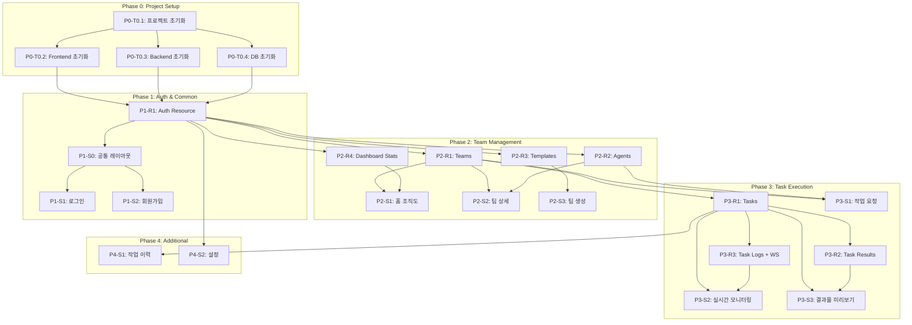

# TASKS.md - AI Agent Team Platform

> Domain-Guarded Task Structure v2.0
> "화면이 주도하되, 도메인이 방어한다"

---

## 의존성 그래프

---

# Phase 0: Project Setup

## [x] P0-T0.1: 프로젝트 초기화
- **담당**: frontend-specialist
- **파일**: `package.json`, `docker-compose.yml`, `.env.example`
- **스펙**: 모노레포 구조 생성, Docker Compose 설정 (PostgreSQL 16, Redis), 환경변수 설정
- **완료 조건**:
  - [ ] `docker-compose up` 으로 DB/Redis 기동
  - [ ] `.env.example` 작성

## [x] P0-T0.2: Frontend 초기화
- **담당**: frontend-specialist
- **파일**: `frontend/package.json`, `frontend/next.config.ts`, `frontend/tailwind.config.ts`
- **스펙**: Next.js 15 (App Router), Tailwind CSS, shadcn/ui, Zustand 설치 및 설정
- **의존**: P0-T0.1
- **완료 조건**:
  - [ ] `npm run dev` 로 Next.js 실행
  - [ ] shadcn/ui 컴포넌트 사용 가능
  - [ ] TypeScript strict mode

## [x] P0-T0.3: Backend 초기화
- **담당**: backend-specialist
- **파일**: `backend/app/main.py`, `backend/requirements.txt`, `backend/pyproject.toml`
- **스펙**: FastAPI, SQLAlchemy 2.0, Celery + Redis, uvicorn 설정
- **의존**: P0-T0.1
- **완료 조건**:
  - [ ] `uvicorn app.main:app` 으로 서버 실행
  - [ ] `/docs` 에서 Swagger UI 확인
  - [ ] Python type hints 설정

## [x] P0-T0.4: DB 초기화
- **담당**: database-specialist
- **파일**: `backend/alembic/`, `backend/app/models/`
- **스펙**: Alembic 마이그레이션 설정, SQLAlchemy 모델 정의 (users, teams, agents, tasks, task_results, task_logs, team_templates), 인덱스 생성
- **의존**: P0-T0.1
- **완료 조건**:
  - [ ] `alembic upgrade head` 로 스키마 생성
  - [ ] 7개 테이블 + 인덱스 생성 확인
  - [ ] 팀 템플릿 시드 데이터 입력

---

# Phase 1: Auth & Common

## P1-R1: Auth Resource

### [x] P1-R1-T1: Auth API 구현
- **담당**: backend-specialist
- **리소스**: users
- **엔드포인트**:
  - POST /api/v1/auth/login (로그인)
  - POST /api/v1/auth/signup (회원가입)
  - GET /api/v1/users/me (내 정보)
  - PUT /api/v1/users/me (정보 수정)
- **필드**: id, email, password_hash, name, plan, api_usage_count
- **인증**: JWT + OAuth2 (Google)
- **파일**: `backend/tests/api/test_auth.py` → `backend/app/api/auth.py`
- **스펙**: JWT 토큰 발급/검증, 비밀번호 해싱 (bcrypt), Google OAuth
- **Worktree**: `worktree/phase-1-auth`
- **TDD**: RED → GREEN → REFACTOR
- **병렬**: P1-S0-T1과 병렬 가능

---

## P1-S0: 공통 레이아웃

### [x] P1-S0-T1: 공통 레이아웃 구현
- **담당**: frontend-specialist
- **화면**: 전체 (dashboard 레이아웃)
- **컴포넌트**:
  - SidebarNavigation (navigation) - 홈, 작업 이력, 새 팀 만들기, 설정
  - Header (navigation) - 검색, 알림, 프로필 메뉴
- **파일**: `frontend/tests/components/Layout.test.tsx` → `frontend/components/layout/DashboardLayout.tsx`
- **스펙**: 반응형 사이드바 (240px, 접기 가능), 헤더, 라우트 하이라이트
- **Worktree**: `worktree/phase-1-layout`
- **TDD**: RED → GREEN → REFACTOR
- **데모**: `/demo/phase-1/s0-layout`
- **데모 상태**: desktop, tablet, mobile
- **병렬**: P1-R1-T1과 병렬 가능

---

## P1-S1: 로그인 화면

> 화면: /login
> 데이터 요구: users

### [x] P1-S1-T1: 로그인 UI 구현
- **담당**: frontend-specialist
- **화면**: /login
- **컴포넌트**:
  - LoginForm (form) - 이메일/비밀번호 입력, 로그인 버튼, Google 로그인
  - SignupLink (navigation) - 회원가입 이동
- **데이터 요구**: users (data_requirements 참조)
- **파일**: `frontend/tests/pages/Login.test.tsx` → `frontend/app/(auth)/login/page.tsx`
- **스펙**: 이메일/비밀번호 입력, 유효성 검사, JWT 저장, 로그인 후 /dashboard 이동
- **Worktree**: `worktree/phase-1-auth`
- **TDD**: RED → GREEN → REFACTOR
- **데모**: `/demo/phase-1/s1-login`
- **데모 상태**: normal, error, loading
- **의존**: P1-R1-T1, P1-S0-T1

### [x] P1-S1-T2: 로그인 통합 테스트
- **담당**: test-specialist
- **화면**: /login
- **시나리오**:
  | 이름 | When | Then |
  |------|------|------|
  | 로그인 성공 | 올바른 이메일/비밀번호 입력 | /dashboard 이동, JWT 저장 |
  | 로그인 실패 | 잘못된 비밀번호 | 에러 메시지 표시 |
  | 비인증 리다이렉트 | 비인증 상태로 /dashboard 접근 | /login으로 리다이렉트 |
- **파일**: `frontend/tests/e2e/login.spec.ts`
- **Worktree**: `worktree/phase-1-auth`

### [x] P1-S1-V: 로그인 연결점 검증
- **담당**: test-specialist
- **화면**: /login
- **검증 항목**:
  - [x] Endpoint: POST /api/v1/auth/login 응답 정상
  - [x] Navigation: LoginForm 성공 → /dashboard 라우트 존재
  - [x] Navigation: SignupLink → /signup 라우트 존재
  - [x] Auth: JWT 토큰 저장/갱신 동작

---

## P1-S2: 회원가입 화면

> 화면: /signup
> 데이터 요구: users

### [x] P1-S2-T1: 회원가입 UI 구현
- **담당**: frontend-specialist
- **화면**: /signup
- **컴포넌트**:
  - SignupForm (form) - 이메일/비밀번호/이름 입력
  - LoginLink (navigation) - 로그인 이동
- **데이터 요구**: users (data_requirements 참조)
- **파일**: `frontend/tests/pages/Signup.test.tsx` → `frontend/app/(auth)/signup/page.tsx`
- **스펙**: 입력 유효성 검사, 회원가입 후 /dashboard 이동
- **Worktree**: `worktree/phase-1-auth`
- **TDD**: RED → GREEN → REFACTOR
- **데모**: `/demo/phase-1/s2-signup`
- **데모 상태**: normal, error, loading
- **의존**: P1-R1-T1, P1-S0-T1

### [x] P1-S2-V: 회원가입 연결점 검증
- **담당**: test-specialist
- **화면**: /signup
- **검증 항목**:
  - [x] Endpoint: POST /api/v1/auth/register 응답 정상
  - [x] Navigation: SignupForm 성공 → /dashboard 라우트 존재
  - [x] Navigation: LoginLink → /login 라우트 존재

---

# Phase 2: Team Management

## Resource 태스크 (백엔드 독립)

### P2-R1: Teams Resource

#### [x] P2-R1-T1: Teams API 구현
- **담당**: backend-specialist
- **리소스**: teams
- **엔드포인트**:
  - GET /api/v1/teams (팀 목록)
  - GET /api/v1/teams/{id} (팀 상세)
  - POST /api/v1/teams (팀 생성)
  - PUT /api/v1/teams/{id} (팀 수정)
  - DELETE /api/v1/teams/{id} (팀 삭제)
- **필드**: id, user_id, name, description, template_id, config, status, agent_count, recent_task_count
- **인증**: 필수 (JWT)
- **파일**: `backend/tests/api/test_teams.py` → `backend/app/api/teams.py`
- **스펙**: 팀 CRUD, 사용자별 필터링, computed fields (agent_count, recent_task_count)
- **Worktree**: `worktree/phase-2-resources`
- **TDD**: RED → GREEN → REFACTOR
- **병렬**: P2-R2-T1, P2-R3-T1, P2-R4-T1과 병렬 가능

### P2-R2: Agents Resource

#### [x] P2-R2-T1: Agents API 구현
- **담당**: backend-specialist
- **리소스**: agents
- **엔드포인트**:
  - GET /api/v1/teams/{team_id}/agents (에이전트 목록)
  - POST /api/v1/teams/{team_id}/agents (에이전트 추가)
  - PUT /api/v1/agents/{id} (에이전트 수정)
  - DELETE /api/v1/agents/{id} (에이전트 삭제)
- **필드**: id, team_id, name, role, layer, model, prompt_template, tools, sort_order, status
- **인증**: 필수 (JWT)
- **파일**: `backend/tests/api/test_agents.py` → `backend/app/api/agents.py`
- **스펙**: 에이전트 CRUD, 팀별 필터링, layer별 정렬, 모델 선택 (opus/sonnet/haiku)
- **Worktree**: `worktree/phase-2-resources`
- **TDD**: RED → GREEN → REFACTOR
- **병렬**: P2-R1-T1, P2-R3-T1, P2-R4-T1과 병렬 가능

### P2-R3: Team Templates Resource

#### [x] P2-R3-T1: Team Templates API 구현
- **담당**: backend-specialist
- **리소스**: team_templates
- **엔드포인트**:
  - GET /api/v1/templates (템플릿 목록)
- **필드**: id, name, description, category, icon, default_agents, is_active
- **파일**: `backend/tests/api/test_templates.py` → `backend/app/api/templates.py`
- **스펙**: 팀 템플릿 목록 조회, 카테고리별 필터링
- **Worktree**: `worktree/phase-2-resources`
- **TDD**: RED → GREEN → REFACTOR
- **병렬**: P2-R1-T1, P2-R2-T1, P2-R4-T1과 병렬 가능

### P2-R4: Dashboard Stats Resource

#### [x] P2-R4-T1: Dashboard Stats API 구현
- **담당**: backend-specialist
- **리소스**: dashboard_stats
- **엔드포인트**:
  - GET /api/v1/dashboard/stats (대시보드 통계)
- **필드**: running_tasks, completed_tasks_today, total_teams
- **인증**: 필수 (JWT)
- **파일**: `backend/tests/api/test_dashboard.py` → `backend/app/api/dashboard.py`
- **스펙**: 사용자별 통계 집계 (진행중 작업, 오늘 완료, 전체 팀 수)
- **Worktree**: `worktree/phase-2-resources`
- **TDD**: RED → GREEN → REFACTOR
- **병렬**: P2-R1-T1, P2-R2-T1, P2-R3-T1과 병렬 가능

---

## Screen 태스크 (프론트엔드)

### P2-S1: 홈 - 조직도 뷰 화면

> 화면: /dashboard
> 데이터 요구: teams, dashboard_stats

#### [x] P2-S1-T1: 홈 조직도 UI 구현
- **담당**: frontend-specialist
- **화면**: /dashboard
- **컴포넌트**:
  - StatsSummary (stat-card) - 오늘의 요약 (진행중/완료/전체 팀)
  - TeamOrgChart (chart) - 전체 팀 조직도 (React Flow)
  - CreateTeamButton (button) - 새 팀 만들기
- **데이터 요구**: teams, dashboard_stats (data_requirements 참조)
- **파일**: `frontend/tests/pages/Dashboard.test.tsx` → `frontend/app/(main)/dashboard/page.tsx`
- **스펙**: React Flow 기반 인터랙티브 조직도, 팀별 상태 색상, 줌/패닝, 빈 상태 처리
- **Worktree**: `worktree/phase-2-dashboard`
- **TDD**: RED → GREEN → REFACTOR
- **데모**: `/demo/phase-2/s1-dashboard`
- **데모 상태**: loading, error, empty, normal
- **의존**: P2-R1-T1, P2-R4-T1

#### [x] P2-S1-T2: 홈 통합 테스트
- **담당**: test-specialist
- **화면**: /dashboard
- **시나리오**:
  | 이름 | When | Then |
  |------|------|------|
  | 초기 로드 | /dashboard 접속 | 요약 카드 + 조직도 표시 |
  | 팀 클릭 | 마케팅 팀 노드 클릭 | /teams/:id 이동 |
  | 빈 상태 | 팀 없음 | 안내 메시지 + 생성 버튼 강조 |
- **파일**: `frontend/tests/e2e/dashboard.spec.ts`
- **Worktree**: `worktree/phase-2-dashboard`

#### [x] P2-S1-V: 홈 연결점 검증
- **담당**: test-specialist
- **화면**: /dashboard
- **검증 항목**:
  - [x] Field Coverage: teams.[id,name,config,status,agent_count,recent_task_count] 존재
  - [x] Field Coverage: dashboard_stats.[running_tasks,completed_tasks_today,total_teams] 존재
  - [x] Endpoint: GET /api/v1/teams 응답 정상
  - [x] Endpoint: GET /api/v1/dashboard/stats 응답 정상
  - [x] Navigation: TeamOrgChart → /teams/:id 라우트 존재
  - [x] Navigation: CreateTeamButton → /teams/new 라우트 존재

---

### P2-S2: 팀 상세 화면

> 화면: /teams/:id
> 데이터 요구: teams, agents, tasks

#### [x] P2-S2-T1: 팀 상세 UI 구현
- **담당**: frontend-specialist
- **화면**: /teams/:id
- **컴포넌트**:
  - TeamHeader (detail) - 팀 이름/설명/상태
  - AgentOrgChart (chart) - 에이전트 계층 조직도 (layer별 색상)
  - AgentDetailPanel (drawer) - 에이전트 상세 사이드 패널
  - RecentTasksList (list) - 최근 작업 미니 리스트
  - NewTaskButton (button) - 새 작업 요청
- **데이터 요구**: teams, agents, tasks (data_requirements 참조)
- **파일**: `frontend/tests/pages/TeamDetail.test.tsx` → `frontend/app/(main)/teams/[id]/page.tsx`
- **스펙**: 에이전트 계층 조직도 (Orchestration/Research/Execution/Quality 색상), 에이전트 클릭 시 드로어
- **Worktree**: `worktree/phase-2-teams`
- **TDD**: RED → GREEN → REFACTOR
- **데모**: `/demo/phase-2/s2-team-detail`
- **데모 상태**: loading, error, normal
- **의존**: P2-R1-T1, P2-R2-T1

#### [x] P2-S2-T2: 팀 상세 통합 테스트
- **담당**: test-specialist
- **화면**: /teams/:id
- **시나리오**:
  | 이름 | When | Then |
  |------|------|------|
  | 초기 로드 | /teams/:id 접속 | 팀 정보 + 에이전트 조직도 표시 |
  | 에이전트 클릭 | blog_writer 노드 클릭 | 사이드 패널 열림 |
   | 새 작업 | "새 작업 요청" 클릭 | 버튼 disabled + Phase 3 안내 표시 |
  | 팀 편집 | 팀 설정 클릭 | 편집 모달 표시 |
- **파일**: `frontend/tests/e2e/team-detail.spec.ts`
- **Worktree**: `worktree/phase-2-teams`

#### [x] P2-S2-V: 팀 상세 연결점 검증
- **담당**: test-specialist
- **화면**: /teams/:id
- **검증 항목**:
  - [x] Field Coverage: teams.[id,name,description,config,status] 존재
  - [x] Field Coverage: agents.[id,name,role,layer,model,status] 존재
  - [x] Field Coverage: tasks 연동은 Phase 3로 deferred (placeholder/안내 문구 적용)
  - [x] Endpoint: GET /api/v1/teams/{id} 응답 정상
  - [x] Endpoint: GET /api/v1/teams/{team_id}/agents 응답 정상
  - [x] Navigation: NewTaskButton은 Phase 3까지 disabled 상태 유지
  - [x] Navigation: RecentTasksList는 Phase 3까지 placeholder 상태 유지

---

### P2-S3: 팀 생성 화면

> 화면: /teams/new
> 데이터 요구: team_templates

#### [x] P2-S3-T1: 팀 생성 UI 구현
- **담당**: frontend-specialist
- **화면**: /teams/new
- **컴포넌트**:
  - StepIndicator (stepper) - 3단계 (템플릿 선택 / 커스터마이즈 / 확인)
  - TemplateGrid (grid) - 팀 템플릿 카드 그리드
  - CustomizeForm (form) - 팀 이름/설명 + 에이전트 편집
  - ConfirmSummary (detail) - 최종 요약 + 생성 버튼
- **데이터 요구**: team_templates (data_requirements 참조)
- **파일**: `frontend/tests/pages/TeamCreate.test.tsx` → `frontend/app/(main)/teams/new/page.tsx`
- **스펙**: 3단계 위저드, 템플릿 기반 팀 생성, 에이전트 추가/삭제/수정, 프롬프트 편집
- **Worktree**: `worktree/phase-2-teams`
- **TDD**: RED → GREEN → REFACTOR
- **데모**: `/demo/phase-2/s3-team-create`
- **데모 상태**: step1, step2, step3, loading
- **의존**: P2-R3-T1

#### [x] P2-S3-T2: 팀 생성 통합 테스트
- **담당**: test-specialist
- **화면**: /teams/new
- **시나리오**:
  | 이름 | When | Then |
  |------|------|------|
  | 템플릿 선택 | 마케팅 팀 클릭 | Step 2, 에이전트 5명 표시 |
  | 에이전트 편집 | 에이전트 추가 클릭 | 새 에이전트 행 추가 |
  | 팀 생성 완료 | Step 3 "팀 생성" 클릭 | /dashboard 이동 |
  | 프롬프트 편집 | 에이전트 편집 아이콘 클릭 | 편집 모달 표시 |
- **파일**: `frontend/tests/e2e/team-create.spec.ts`
- **Worktree**: `worktree/phase-2-teams`

#### [x] P2-S3-V: 팀 생성 연결점 검증
- **담당**: test-specialist
- **화면**: /teams/new
- **검증 항목**:
  - [x] Field Coverage: team_templates.[id,name,description,category,icon,default_agents] 존재
  - [x] Endpoint: GET /api/v1/templates 응답 정상
  - [x] Endpoint: POST /api/v1/teams 응답 정상
  - [x] Endpoint: POST /api/v1/teams/{team_id}/agents 응답 정상
  - [x] Navigation: ConfirmSummary 성공 → /dashboard 라우트 존재

---

# Phase 3: Task Execution

## Resource 태스크 (백엔드 독립)

### P3-R1: Tasks Resource

#### [ ] P3-R1-T1: Tasks API 구현
- **담당**: backend-specialist
- **리소스**: tasks
- **엔드포인트**:
  - GET /api/v1/tasks (작업 목록 - 필터/페이지네이션)
  - GET /api/v1/tasks/{id} (작업 상세)
  - POST /api/v1/teams/{team_id}/tasks (작업 생성)
  - PUT /api/v1/tasks/{id}/cancel (작업 취소)
- **필드**: id, team_id, user_id, type, input, options, status, progress, started_at, completed_at, team_name, duration
- **인증**: 필수 (JWT)
- **파일**: `backend/tests/api/test_tasks.py` → `backend/app/api/tasks.py`
- **스펙**: 작업 CRUD, 상태 관리 (pending→running→completed/failed/cancelled), 팀별/상태별/날짜별 필터링, Celery 큐 연동
- **Worktree**: `worktree/phase-3-resources`
- **TDD**: RED → GREEN → REFACTOR
- **병렬**: P3-R2-T1, P3-R3-T1과 병렬 가능 (기본 Tasks 모델 완료 후)

### P3-R2: Task Results Resource

#### [ ] P3-R2-T1: Task Results API 구현
- **담당**: backend-specialist
- **리소스**: task_results
- **엔드포인트**:
  - GET /api/v1/tasks/{task_id}/results (결과물 목록)
  - GET /api/v1/tasks/{task_id}/results/{id}/download (다운로드)
- **필드**: id, task_id, agent_id, result_type, content, file_url, metadata, quality_score, version
- **인증**: 필수 (JWT)
- **파일**: `backend/tests/api/test_task_results.py` → `backend/app/api/task_results.py`
- **스펙**: 결과물 조회, result_type별 필터링, 파일 다운로드 (개별/ZIP), 수정 버전 관리
- **Worktree**: `worktree/phase-3-resources`
- **TDD**: RED → GREEN → REFACTOR
- **병렬**: P3-R1-T1 완료 후, P3-R3-T1과 병렬 가능

### P3-R3: Task Logs + WebSocket Resource

#### [ ] P3-R3-T1: Task Logs API + WebSocket 구현
- **담당**: backend-specialist
- **리소스**: task_logs
- **엔드포인트**:
  - GET /api/v1/tasks/{task_id}/logs (로그 목록)
  - WS /ws/tasks/{task_id} (실시간 스트리밍)
- **필드**: id, task_id, agent_id, status, message, progress
- **인증**: 필수 (JWT, WebSocket 토큰)
- **파일**: `backend/tests/api/test_task_logs.py` → `backend/app/api/ws.py`
- **스펙**: 에이전트별 로그 조회, WebSocket 실시간 진행률/상태 스트리밍, 연결 끊김 재연결
- **Worktree**: `worktree/phase-3-resources`
- **TDD**: RED → GREEN → REFACTOR
- **병렬**: P3-R1-T1 완료 후, P3-R2-T1과 병렬 가능

---

## Screen 태스크 (프론트엔드)

### P3-S1: 작업 요청 화면

> 화면: /teams/:id/tasks/new
> 데이터 요구: teams, agents

#### [ ] P3-S1-T1: 작업 요청 UI 구현
- **담당**: frontend-specialist
- **화면**: /teams/:id/tasks/new
- **컴포넌트**:
  - StepIndicator (stepper) - 3단계 (옵션 선택 / 입력 / 확인)
  - Step1Options (form) - 팀별 맞춤 옵션 (체크박스/라디오)
  - Step2Input (form) - URL/텍스트/파일 업로드 + 추가 지시사항
  - Step3Confirm (detail) - 옵션 요약 + 실행 버튼
- **데이터 요구**: teams, agents (data_requirements 참조)
- **파일**: `frontend/tests/pages/TaskRequest.test.tsx` → `frontend/app/(main)/teams/[id]/tasks/new/page.tsx`
- **스펙**: 3단계 위저드, 팀별 동적 옵션, URL 유효성 검사, 파일 업로드, 요약 확인 후 실행
- **Worktree**: `worktree/phase-3-task-flow`
- **TDD**: RED → GREEN → REFACTOR
- **데모**: `/demo/phase-3/s1-task-request`
- **데모 상태**: step1, step2-url, step2-file, step3, loading
- **의존**: P2-R1-T1, P2-R2-T1, P3-R1-T1

#### [ ] P3-S1-T2: 작업 요청 통합 테스트
- **담당**: test-specialist
- **화면**: /teams/:id/tasks/new
- **시나리오**:
  | 이름 | When | Then |
  |------|------|------|
  | 단계별 진행 | Step 1 선택 후 다음 | Step 2 표시 |
  | URL 입력 실행 | YouTube URL 입력 + 실행 | /tasks/:id/monitor 이동 |
  | 파일 업로드 | PDF 업로드 | 미리보기 표시 |
  | 옵션 요약 | Step 3 도달 | 모든 옵션 요약 표시 |
- **파일**: `frontend/tests/e2e/task-request.spec.ts`
- **Worktree**: `worktree/phase-3-task-flow`

#### [ ] P3-S1-V: 작업 요청 연결점 검증
- **담당**: test-specialist
- **화면**: /teams/:id/tasks/new
- **검증 항목**:
  - [ ] Field Coverage: teams.[id,name,config] 존재
  - [ ] Field Coverage: agents.[id,name,role] 존재
  - [ ] Endpoint: POST /api/v1/teams/{team_id}/tasks 응답 정상
  - [ ] Navigation: Step3Confirm 실행 → /tasks/:id/monitor 라우트 존재

---

### P3-S2: 실시간 모니터링 화면

> 화면: /tasks/:id/monitor
> 데이터 요구: tasks, agents, task_logs

#### [ ] P3-S2-T1: 실시간 모니터링 UI 구현
- **담당**: frontend-specialist
- **화면**: /tasks/:id/monitor
- **컴포넌트**:
  - OverallProgress (stat-card) - 전체 진행률 바
  - AgentStatusGrid (grid) - 에이전트별 상태 카드 (이름, 상태 아이콘, 메시지, 진행률)
  - LogStream (list) - 실시간 로그 스트림 (접기/펼치기)
  - CancelButton (button) - 작업 취소
  - ViewResultsButton (button) - 결과물 보기 (완료 시 활성화)
- **데이터 요구**: tasks, agents, task_logs (data_requirements 참조)
- **파일**: `frontend/tests/pages/TaskMonitor.test.tsx` → `frontend/app/(main)/tasks/[id]/monitor/page.tsx`
- **스펙**: WebSocket 실시간 업데이트, 에이전트 상태 색상 (🟢작업중/🟡대기/✅완료/🔴오류), 진행률 애니메이션, 완료 시 결과 버튼 활성화
- **Worktree**: `worktree/phase-3-task-flow`
- **TDD**: RED → GREEN → REFACTOR
- **데모**: `/demo/phase-3/s2-task-monitor`
- **데모 상태**: running, partial-complete, all-complete, error
- **의존**: P3-R1-T1, P3-R3-T1

#### [ ] P3-S2-T2: 실시간 모니터링 통합 테스트
- **담당**: test-specialist
- **화면**: /tasks/:id/monitor
- **시나리오**:
  | 이름 | When | Then |
  |------|------|------|
  | 실시간 업데이트 | WebSocket 상태 변경 수신 | 카드 상태/메시지 업데이트 |
  | 작업 완료 | 모든 에이전트 완료 | "결과물 보기" 버튼 활성화 |
  | 작업 취소 | 취소 버튼 + 확인 | 상태 cancelled 변경 |
  | 오류 발생 | 에이전트 오류 상태 | 오류 아이콘/메시지 표시 |
- **파일**: `frontend/tests/e2e/task-monitor.spec.ts`
- **Worktree**: `worktree/phase-3-task-flow`

#### [ ] P3-S2-V: 실시간 모니터링 연결점 검증
- **담당**: test-specialist
- **화면**: /tasks/:id/monitor
- **검증 항목**:
  - [ ] Field Coverage: tasks.[id,status,progress,team_id] 존재
  - [ ] Field Coverage: task_logs.[agent_id,status,message,progress] 존재
  - [ ] Endpoint: GET /api/v1/tasks/{id} 응답 정상
  - [ ] Endpoint: WS /ws/tasks/{task_id} 연결 정상
  - [ ] Navigation: ViewResultsButton → /tasks/:id/results 라우트 존재
  - [ ] Auth: WebSocket JWT 토큰 검증

---

### P3-S3: 결과물 미리보기 화면

> 화면: /tasks/:id/results
> 데이터 요구: tasks, task_results

#### [ ] P3-S3-T1: 결과물 미리보기 UI 구현
- **담당**: frontend-specialist
- **화면**: /tasks/:id/results
- **컴포넌트**:
  - ResultTabs (tabs) - 결과물 유형별 탭 (블로그/SNS/뉴스레터)
  - ResultContent (detail) - 텍스트 렌더링 + 파일 미리보기
  - ResultMetadata (detail) - 메타데이터 (시간, 모델, 품질 점수)
  - RevisionForm (form) - 수정 요청 입력
  - DownloadAllButton (button) - 전체 다운로드
- **데이터 요구**: tasks, task_results (data_requirements 참조)
- **파일**: `frontend/tests/pages/TaskResults.test.tsx` → `frontend/app/(main)/tasks/[id]/results/page.tsx`
- **스펙**: 유형별 탭, Markdown 렌더링, 수정 요청 → 재생성, ZIP 다운로드
- **Worktree**: `worktree/phase-3-task-flow`
- **TDD**: RED → GREEN → REFACTOR
- **데모**: `/demo/phase-3/s3-task-results`
- **데모 상태**: loading, normal-blog, normal-sns, revision
- **의존**: P3-R1-T1, P3-R2-T1

#### [ ] P3-S3-T2: 결과물 미리보기 통합 테스트
- **담당**: test-specialist
- **화면**: /tasks/:id/results
- **시나리오**:
  | 이름 | When | Then |
  |------|------|------|
  | 초기 로드 | /tasks/:id/results 접속 | 유형별 탭 + 첫 번째 콘텐츠 표시 |
  | 수정 요청 | 수정 입력 후 "수정 요청" 클릭 | 새 작업 생성, /tasks/:newId/monitor 이동 |
  | 다운로드 | 전체 다운로드 클릭 | ZIP 다운로드 시작 |
  | 품질 점수 | QA 결과 포함 | 품질 뱃지 표시 |
- **파일**: `frontend/tests/e2e/task-results.spec.ts`
- **Worktree**: `worktree/phase-3-task-flow`

#### [ ] P3-S3-V: 결과물 미리보기 연결점 검증
- **담당**: test-specialist
- **화면**: /tasks/:id/results
- **검증 항목**:
  - [ ] Field Coverage: tasks.[id,type,status,created_at,completed_at] 존재
  - [ ] Field Coverage: task_results.[id,result_type,content,file_url,quality_score,version] 존재
  - [ ] Endpoint: GET /api/v1/tasks/{task_id}/results 응답 정상
  - [ ] Endpoint: GET /api/v1/tasks/{task_id}/results/{id}/download 응답 정상
  - [ ] Navigation: RevisionForm → /tasks/:id/monitor 라우트 존재

---

# Phase 4: Additional Screens

### P4-S1: 작업 이력 화면

> 화면: /tasks/history
> 데이터 요구: tasks, teams

#### [ ] P4-S1-T1: 작업 이력 UI 구현
- **담당**: frontend-specialist
- **화면**: /tasks/history
- **컴포넌트**:
  - FilterBar (filter-form) - 팀별/날짜/상태 필터
  - TaskTable (table) - 작업 목록 (날짜, 팀, 유형, 상태, 소요 시간)
  - Pagination (navigation) - 페이지네이션
- **데이터 요구**: tasks, teams (data_requirements 참조)
- **파일**: `frontend/tests/pages/TaskHistory.test.tsx` → `frontend/app/(main)/tasks/history/page.tsx`
- **스펙**: 필터링, 정렬, 페이지네이션, 행 클릭 시 결과물 이동
- **Worktree**: `worktree/phase-4-additional`
- **TDD**: RED → GREEN → REFACTOR
- **데모**: `/demo/phase-4/s1-task-history`
- **데모 상태**: loading, empty, normal, filtered
- **의존**: P3-R1-T1

#### [ ] P4-S1-V: 작업 이력 연결점 검증
- **담당**: test-specialist
- **화면**: /tasks/history
- **검증 항목**:
  - [ ] Field Coverage: tasks.[id,type,status,created_at,completed_at,team_name,duration] 존재
  - [ ] Endpoint: GET /api/v1/tasks (필터/페이지네이션) 응답 정상
  - [ ] Navigation: TaskTable 행 클릭 → /tasks/:id/results 라우트 존재

---

### P4-S2: 설정 화면

> 화면: /settings
> 데이터 요구: users

#### [ ] P4-S2-T1: 설정 UI 구현
- **담당**: frontend-specialist
- **화면**: /settings
- **컴포넌트**:
  - ProfileSection (form) - 프로필 편집
  - ApiKeySection (form) - Claude API 키 관리
  - SubscriptionSection (detail) - 구독 관리
  - NotificationSection (form) - 알림 설정
  - DataManagementSection (detail) - 데이터 관리
- **데이터 요구**: users (data_requirements 참조)
- **파일**: `frontend/tests/pages/Settings.test.tsx` → `frontend/app/(main)/settings/page.tsx`
- **스펙**: 프로필 수정, API 키 마스킹 저장, 구독 플랜 표시, 알림 토글, 이력 내보내기/삭제
- **Worktree**: `worktree/phase-4-additional`
- **TDD**: RED → GREEN → REFACTOR
- **데모**: `/demo/phase-4/s2-settings`
- **데모 상태**: normal, editing, saving
- **의존**: P1-R1-T1

#### [ ] P4-S2-V: 설정 연결점 검증
- **담당**: test-specialist
- **화면**: /settings
- **검증 항목**:
  - [ ] Field Coverage: users.[id,email,name,plan,api_usage_count] 존재
  - [ ] Endpoint: GET /api/v1/users/me 응답 정상
  - [ ] Endpoint: PUT /api/v1/users/me 응답 정상

---

# Phase Summary

| Phase | Resource 태스크 | Screen 태스크 | 검증 태스크 | 합계 |
|-------|---------------|-------------|-----------|------|
| P0 | - | - | - | 4 |
| P1 | 1 | 3 (layout + 2) | 2 | 6 |
| P2 | 4 | 3 | 3 | 16 |
| P3 | 3 | 3 | 3 | 15 |
| P4 | - | 2 | 2 | 4 |
| **합계** | **8** | **11** | **10** | **45** |

---

# AI Service Integration (Phase 3 추가)

### [ ] P3-AI-T1: Claude API 연동 서비스 구현
- **담당**: backend-specialist
- **파일**: `backend/tests/services/test_ai_service.py` → `backend/app/services/ai_service.py`
- **스펙**: Claude API (Anthropic SDK) 연동, 에이전트별 프롬프트 실행, 모델 라우팅 (opus/sonnet/haiku), 스트리밍 응답, 에러 핸들링
- **Worktree**: `worktree/phase-3-resources`
- **TDD**: RED → GREEN → REFACTOR

### [ ] P3-AI-T2: Celery 작업 워커 구현
- **담당**: backend-specialist
- **파일**: `backend/tests/workers/test_task_worker.py` → `backend/app/workers/task_worker.py`
- **스펙**: Celery 태스크 정의, 에이전트 순차/병렬 실행, 진행률 업데이트 (WebSocket), 에러 복구, 작업 취소 처리
- **Worktree**: `worktree/phase-3-resources`
- **TDD**: RED → GREEN → REFACTOR
- **의존**: P3-AI-T1, P3-R3-T1
